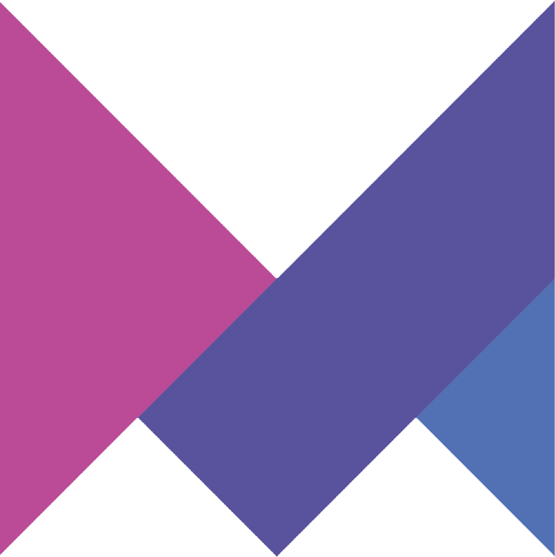

<h1 align="center">👋 Hi, I'm Mohammad NiKO</h1>
<p align="center">
  Frontend developer focused on crafting clean UI & pixel-perfect code. Passionate about solving real problems with creative interfaces.
</p>

<div align="center">
  
</div>

---

### ✨ About Me

- 📍 Living in **Mashhad**, IR
- 💬 Nickname: **Mohammad iKO** | **M’iKO**  
- 🌍 English level: **Intermediate**  
- 🚀 Currently learning: **Next.js**
- ☕ Fan of `Code with Coffee` ☕  
- 📬 Email: [developer-iko-mike@gmail.com](mailto:developer-iko-mike@gmail.com)  
- 💬 Telegram: [@DevMiko](https://t.me/DevMiko)  

---

### 🔧 Tech Stack

<p align="left">
  
  
  
  
  
  
  
  
  
  
  
  
  
</p>

---

### 🎯 Skills & Libraries I Work With

<p align="left">                  </p>


---

### 🧠 Projects & Highlights

- ✅ سایت مشابه **سبزلرن** با طراحی اختصاصی  
- ✅ چند **سایت شخصی حرفه‌ای و ریسپانسیو**  
- ✅ سایت تک‌صفحه‌ای **مک‌دونالد**  
- ✅ سایت شرکتی برای **اجاره مکان در طبیعت**  
- ✅ طراحی دو **پنل ادمین داشبورد**  
- ✅ سایت مشابه **واریاشاپ** برای فروش جم بازی  
- ✅ طراحی سایت فروش **لوازم کامپیوتر**  
- ✅ انتشار یک پکیج اختصاصی **SVG**

---

### 🛠 26 JavaScript Mini Projects

<details>
<summary>📂 مشاهده لیست کامل</summary>

```

1. AboutKey         10. LoadingBeforeSite    19. Profile
2. BookList         11. MakeLorem            20. Random-BG
3. BoxRandomImage   12. multiplay            21. RegEx
4. BuyTickets       13. MusicPlayer          22. RightClickMenu
5. Convert-C-To-F   14. MusicPlayer2         23. SearchBoxCoustomTitle
6. GetUsersRandom   15. NoteApp              24. ShoesShop
7. InputMaxLengh    16. NoteApp2             25. ThemeSwitcher
8. KeyBoard         17. Pageitions           26. TodoList
9. LightRange       18. PasswordToggle

```

</details>

### 🖥 Stats & Activity

<p align="center">
  
  
</p>

---

> 🧠 Inspired by top GitHub developers  
> ❤️ Built with passion & coffee by **M’iKO**
